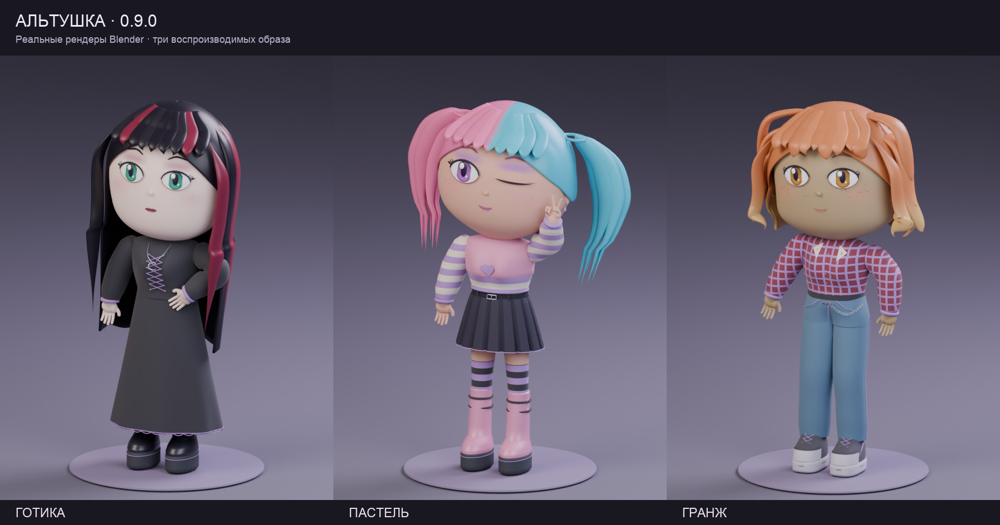
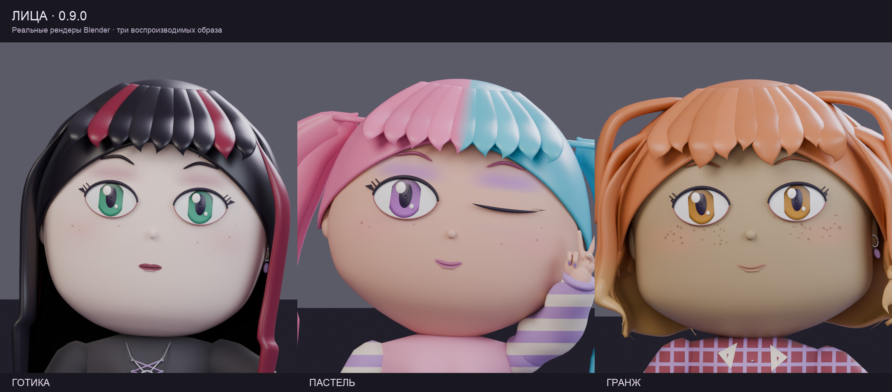
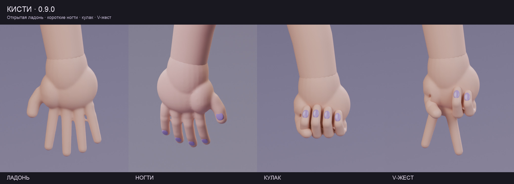

# ALTUSHKA · Chibi Character Generator

A modular Blender add-on for creating adult chibi characters in alternative fashion. Build a character manually or randomize body proportions, face, makeup, hair, skin, clothing, accessories, standing poses and hand gestures.

[Русский](README.md) · [Download add-on 0.9.0](releases/chibi_generator_v0.9.0.zip) · [Gallery](docs/GALLERY.md)



**Version 0.9.0. Tested with Blender 5.2.2 LTS on macOS. The add-on UI is currently in Russian.** Generation runs locally using the bundled geometry and procedural materials. No AI model, account, external asset service or additional Python package installation is required to use the add-on.

## Features

- Body height, chest and glute volume, thigh/calf size, leg asymmetry, shoulder tilt and posture variation.
- 6 face presets, continuous face, nose, lip and brow controls, 5 expressions, 6 eye colors and 10 makeup presets.
- 30 hairstyles, 18 hair colors and 5 coloring patterns.
- 12 skin tones with lightness and warm/cool undertone controls.
- 57 clothing/shoe items, 5 legwear options, 6 clothing palettes and 18 accessories.
- 25 weighted fashion styles; mix up to three styles.
- Unified five-finger hands, attached short nails, 10 standing poses, pose mirroring and 6 independent gestures per hand.
- Reproducible seeds, 7 appearance locks, JSON presets, favorites, `.blend` scenes and PNG rendering.
- Editable Blender meshes and a shared 52-bone armature.

## Installation

1. Download the [add-on ZIP](releases/chibi_generator_v0.9.0.zip); keep it zipped.
2. In Blender, open **Edit → Preferences → Add-ons**.
3. Use the upper-right menu → **Install from Disk…** and select the ZIP.
4. Enable **CHIBI CHARACTER GENERATOR**.
5. In the 3D Viewport, press **N**, open **АЛЬТУШКА**, then click **Случайная альтушка** to generate a character.

See the [official Blender add-on installation guide](https://docs.blender.org/manual/en/latest/editors/preferences/addons.html). This is a conventional ZIP add-on, not a Blender Extensions manifest package. Other Blender versions and Windows/Linux have not been tested. The 4.2 minimum declared in `bl_info` is not a verified compatibility promise for the bundled `.blend` assets.

## Faces, hair and hands in 0.9.0

Six new face controls, a wink, tapered hair tips, smoother fingers and closer-fitting short nails. All face and hair thumbnails have been refreshed.



[Reference views and reproducible presets](docs/CHARACTER_POLISH.md).

## Materials in 0.8.1

Distinct procedural knit, denim, leather, vinyl and velvet surfaces; fine relief uses neutral mesh coordinates to stay attached during body and pose changes. Colors and patterns are preserved. No texture downloads are needed.


This patch also fixes generation after File > New, cosmetic visibility, pose resets during seeded regeneration, and camera setup after JSON loading.

## Basic workflow

Lock appearance groups before randomizing. Use the individual tabs for manual editing. Choose a fashion style and optionally include makeup/hair when applying it. Dresses replace the top and bottom slots.

The **Позы** tab controls poses, mirroring, and the left/right hand gestures. **По позе** uses the preset gesture; **Сбросить позу и жесты** resets the pose. Appearance randomization preserves the pose.

The **Мои** tab contains favorites and JSON/scene/image saving. JSON stores generator parameters; save a `.blend` file to retain manual mesh or material edits. Favorites live in Blender's user data directory and are not part of this repository.




Public JSON examples are available in [examples/](examples/). [API examples](docs/API.md).

## Current limitations

Fixed standing poses only; no seated poses, walk cycles, transitions, cloth simulation or hair physics. Hair follows the head bone. Some long-hair, bulky-sleeve and accessory combinations can intersect. Not every combination has been checked in every pose.

Changing appearance reapplies the selected pose and overwrites direct Pose Mode edits. Mesh fabric and distressed denim use stylized procedural shading/insets. Game-ready optimization, texture baking and dedicated GLB/FBX export controls are not implemented. Standard Blender exports may need material conversion and removal of cached hidden wardrobe meshes. The UI has no English localization yet.

## Development

Use Python 3.11+ for model tests and packaging; no third-party dependencies:

```sh
python3 -m unittest discover -s tests -p 'test_*.py'
python3 scripts/check_repository.py
python3 scripts/build_addon.py
```

The ZIP and SHA-256 checksum are written to `dist/`. GitHub Actions runs model tests, repository checks and packaging. To run the separate integration suites with an existing Blender installation:

```sh
python3 scripts/test_blender.py --blender "/path/to/blender"
```

Integration tests use a public deterministic v0.7 fixture, not personal scenes. Logs/reports are written to `build/test-reports/`.

[Development guide](docs/DEVELOPMENT.md) · [Contributing](CONTRIBUTING.md) · [Changelog](CHANGELOG.md) · [Roadmap](ROADMAP.md)

## License

A license has not been selected yet. A `LICENSE` file will be added after the author's decision.
