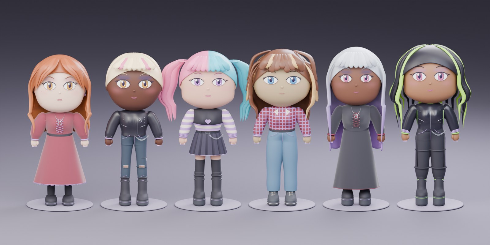
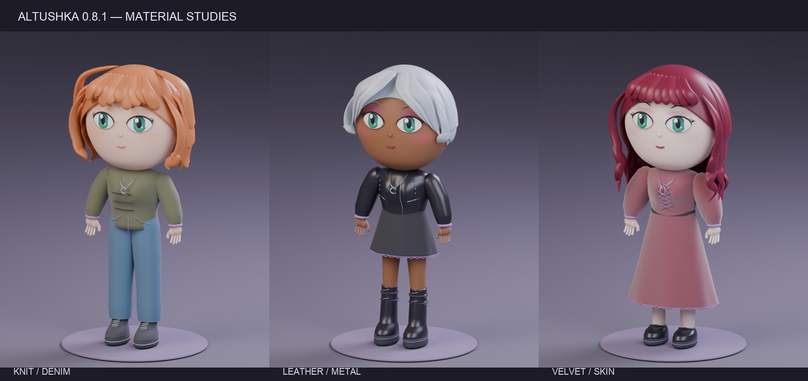
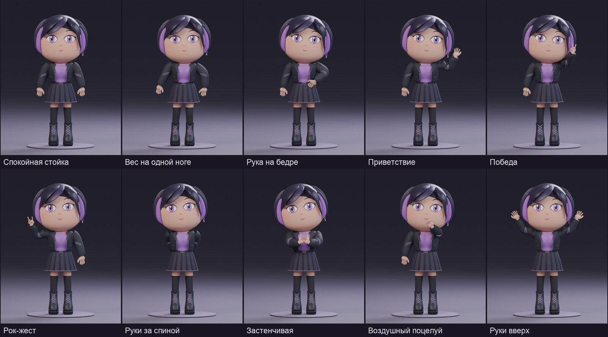
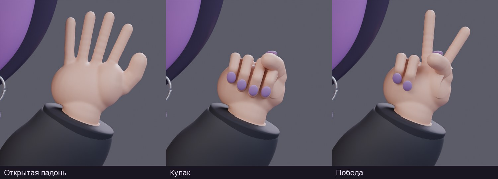

# АЛЬТУШКА · Chibi Character Generator

**Модульный генератор взрослых chibi-персонажей для Blender.** Собирай образ вручную или случайно: пропорции, лицо, макияж, причёска, кожа, одежда, украшения, поза и жесты рук.

[English](README.en.md) · [Установить 0.8.1](releases/chibi_generator_v0.8.1.zip) · [Все каталоги](docs/GALLERY.md) · [Для разработчиков](docs/DEVELOPMENT.md)



> Версия **0.8.1**. Проверено в **Blender 5.2.2 LTS на macOS**. Интерфейс дополнения — на русском. Работа локальная: отдельные модели ИИ, сервисы, учётные записи и загрузки ассетов не нужны.

## Возможности

| Раздел | Что доступно |
| --- | --- |
| Тело | Рост, грудь, ягодицы, объём бёдер и икр, асимметрия ног, наклон плеч, вариации осанки |
| Лицо | 6 пресетов, непрерывная настройка формы, 4 выражения, 6 цветов глаз |
| Макияж | 10 наборов, интенсивность, веснушки |
| Волосы | 30 причёсок, 18 цветов, 5 способов окрашивания |
| Кожа | 12 базовых оттенков, светлота и тёплый/холодный подтон |
| Гардероб | 25 верхов, 16 вариантов низа, 8 платьев, 8 видов обуви |
| Детали | 18 аксессуаров, 5 вариантов покрытия ног, 6 цветовых режимов одежды |
| Стили | 25 направлений и смешивание до трёх стилей с заданными долями |
| Кисти и позы | Цельные кисти с пятью пальцами, короткие ногти, 10 стоячих поз, отражение, 6 жестов для каждой руки |
| Сохранение | Избранное, JSON-пресеты, сцены `.blend`, PNG-рендеры |

Случайная генерация использует воспроизводимый **seed** и семь независимых замков: тело, лицо, макияж, одежда, детали, волосы и кожа. Поза сохраняется при смене внешности; для неё предусмотрена отдельная случайная кнопка.

Все элементы персонажа — редактируемые меши Blender. Общий скелет содержит 52 кости. Одежда следует параметрам тела; скрытые варианты кешируются внутри сцены и повторно используются.

## Установка

1. Скачай [ZIP дополнения 0.8.1](releases/chibi_generator_v0.8.1.zip). Распаковывать его для установки не нужно.
2. В Blender открой **Edit → Preferences → Add-ons**.
3. В меню справа сверху выбери **Install from Disk…** и укажи ZIP дополнения.
4. Включи **CHIBI CHARACTER GENERATOR**.
5. В окне 3D Viewport нажми **N**, открой вкладку **АЛЬТУШКА** и нажми **«Случайная альтушка»**.

Порядок установки описан также в [официальном руководстве Blender](https://docs.blender.org/manual/en/latest/editors/preferences/addons.html).

Дополнение поставляется как обычный ZIP add-on. Пакет для Blender Extensions с manifest пока не подготовлен. `bpy` и NumPy используются из установленного Blender; устанавливать их через `pip` для работы дополнения не требуется. Другие версии Blender и Windows/Linux пока не проверены. Указанный в `bl_info` минимум 4.2 не является подтверждением совместимости всех ассетов с этой версией.

## Быстрый старт

- **Случайный образ.** Закрепи нужные части замками и нажми большую кнопку случайной сборки. Номер образа находится в дополнительных настройках; его можно использовать для повторной генерации.
- **Ручная сборка.** Выбирай вкладки «Тело», «Лицо», «Макияж», «Одежда», «Детали», «Волосы» и «Кожа». В разделах с миниатюрами нажми на картинку для выбора пресета.
- **Стиль.** Выбери направление и нажми «Собрать образ по стилю». По желанию включи подбор макияжа и причёски. Тело, лицо и кожа сохраняются. Для смешивания задай доли второго и третьего направлений.
- **Одежда.** Платье заменяет верх и низ. Выбери «Без платья», чтобы снова собрать комплект из двух частей.
- **Позы.** Выбери позу, отражение и жесты левой/правой кисти. «По позе» использует готовое сочетание. «Сбросить позу и жесты» возвращает спокойную стойку.
- **Сохранение.** Во вкладке «Мои» добавь образ в избранное, сохрани настройки в JSON, сцену или картинку. Для возврата к запомненному образу используй «Запомнить» и «Вернуть».

Избранное хранится в пользовательской папке данных Blender. JSON содержит параметры генерации; для ручных правок мешей и материалов сохраняй `.blend`.

## Материалы · 0.8.1

Вязка, джинса, кожа, винил и бархат используют разные процедурные поверхности. Рельеф ткани закреплён на исходной сетке. Цвета и принты сохраняются; внешние изображения скачивать не нужно.



[Сравнение до/после и исправления](docs/MATERIALS.md).

## Кисти и позы





Пальцы имеют отдельные суставы и веса. Ногти следуют за кончиками пальцев. Можно независимо выбирать открытую ладонь, расслабленную кисть, кулак, жест победы, рок-жест и указующий палец.

## Стили

Classic Goth, Romantic Goth, Pastel Goth, Cyber Goth, Emo, Scene, E-girl, Grunge, Soft Grunge, Punk, Hardcore Punk, Metalhead, Nu-metal / Y2K, Mall Goth, Industrial, Techwear Alt, Vampire Goth, Witchy, Dark Academia, Gothic Lolita, Visual Kei-inspired, Yami Kawaii / Menhera, Alt Skater, Indie Alt и Fairy Grunge.

Стиль задаёт вероятности вещей и деталей, поэтому у одного направления могут получаться разные комплекты. Графика на футболках использует собственные мотивы; реальные логотипы групп не включены.

## Примеры и API

В [examples/](examples/) есть JSON-пресеты лица, макияжа, причёсок и поз. Загружай их через «Мои → Настройки: Открыть».

Пример для Python Console внутри Blender:

```python
import bpy
from chibi_generator import generate_character

character = generate_character(seed=12345, style="goth")
character.set_hair(preset="twin_tails", color="pink", secondary="cyan", pattern="split")
character.set_skin(preset="caramel", shade=0.05, undertone=-0.1)
character.set_pose(preset="peace", mirror=False, left="auto", right="fist")
character.save_preset(bpy.path.abspath("//character.json"))
```

[Примеры API и конфигурации](docs/API.md).

## Что пока ограничено

- Поставляются фиксированные стоячие позы. Сидение, походка, переходы и физика одежды/волос не реализованы.
- Волосы следуют за головой; у кос и отдельных прядей нет собственного скелета.
- Возможны пересечения в отдельных сочетаниях длинных волос, крупных рукавов и аксессуаров. Все сочетания во всех позах не проверены.
- Изменение внешности повторно применяет выбранную позу и перезаписывает ручные правки костей в Pose Mode.
- Сетка ткани и прорези денима стилизованы процедурными материалами и вставками.
- Автоматическая подготовка к игровому движку, запекание текстур и кнопки GLB/FBX-экспорта пока не добавлены. При обычном экспорте Blender могут потребоваться ручная подготовка материалов и удаление скрытого гардероба.
- Интерфейс пока не локализован на английский.

## Разработка и проверки

Для тестов модели и сборки достаточно Python 3.11+:

```sh
python3 -m unittest discover -s tests -p 'test_*.py'
python3 scripts/check_repository.py
python3 scripts/build_addon.py
```

ZIP и SHA-256 появятся в `dist/`. Сборщик использует только стандартную библиотеку Python. GitHub Actions выполняет тесты модели, проверку структуры и сборку; Blender-тесты запускаются отдельно с уже установленным Blender:

```sh
python3 scripts/test_blender.py --blender "/path/to/blender"
```

Проверки покрывают параметры, воспроизводимость, независимые группы, ручные элементы интерфейса, гардероб, материалы, волосы, кожу, кисти, позы и миграцию демонстрационного сохранения 0.7. Личные сцены не нужны. Отчёты и логи пишутся в `build/test-reports/`.

[Проверка выпуска](docs/VALIDATION.md) · [Разработка](docs/DEVELOPMENT.md) · [Участие](CONTRIBUTING.md) · [История изменений](CHANGELOG.md) · [Планы](ROADMAP.md) · [Публикация на GitHub](docs/PUBLISHING.md)

## Лицензия

Лицензия пока не выбрана. Файл `LICENSE` будет добавлен после решения автора.
