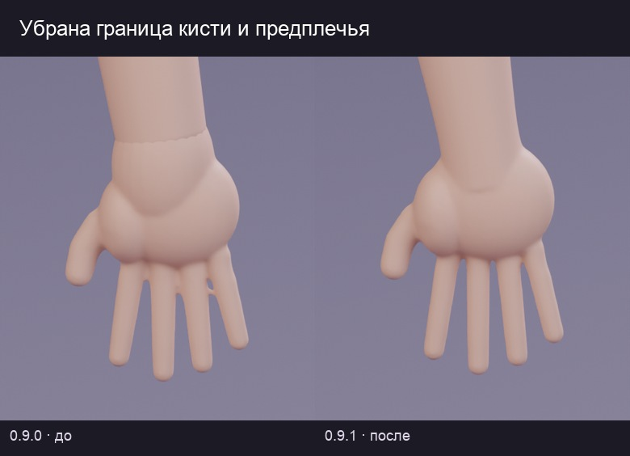
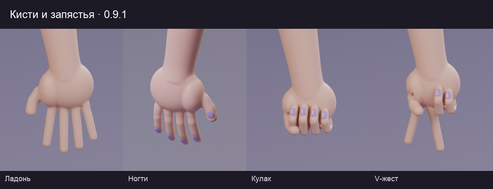
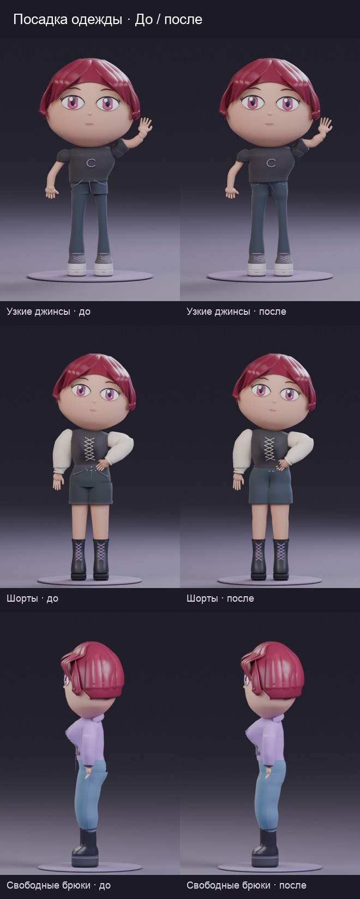
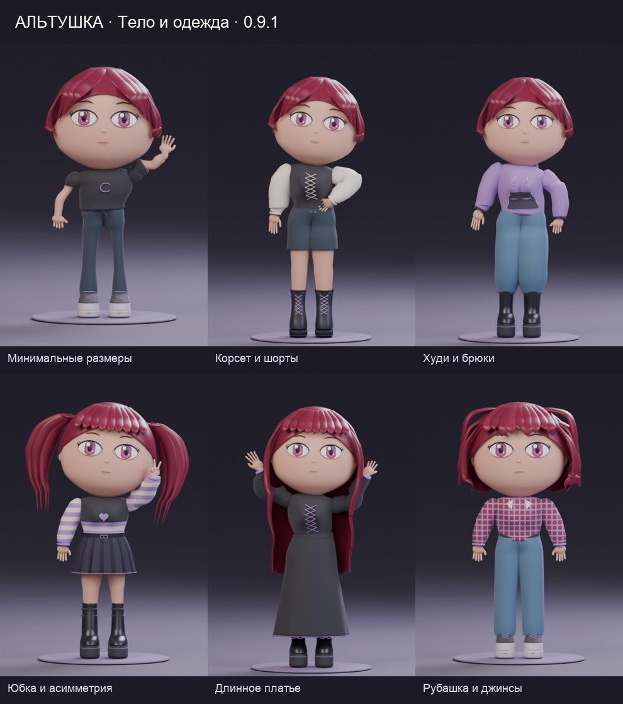
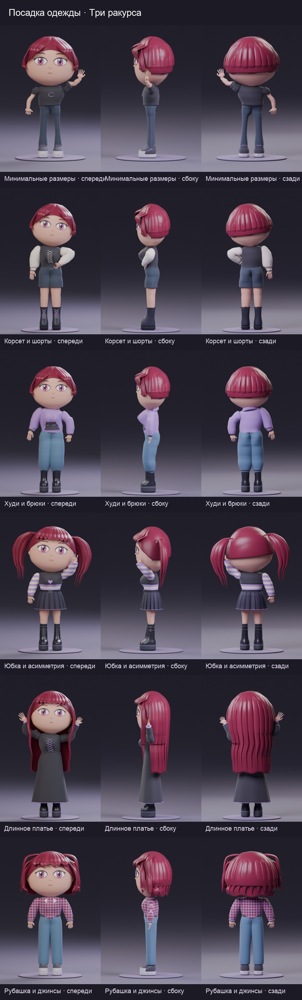

# Тело и посадка одежды · 0.9.1

[На главную](../README.md) · [План развития](../ROADMAP.md)

Рука теперь одна замкнутая поверхность от плеча до кончиков пальцев. Убрана граница кисти и предплечья; общие веса кожи и рукавов сохраняют мягкий локоть при сгибании. Колено получило более плавный профиль.

Брюки и шорты объединены в цельную поверхность. Убраны выступающие края отдельных тазовых панелей, сглажена деформация на границе бедра и таза, сохранена непрерывность в центре при асимметрии ног. Швы проецируются на готовую нейтральную поверхность. Юбки получили небольшую толщину внутрь, длинные рукава — неглубокие складки.

## Контрольные образы

| Пресет | Что проверяем |
| --- | --- |
| [Petite denim](../examples/body_fit/petite_denim.json) | Минимальные размеры тела, узкие джинсы, поднятая рука |
| [Full corset](../examples/body_fit/full_corset.json) | Максимальные размеры, шорты, пышный рукав, рука на бедре |
| [Full knit](../examples/body_fit/full_knit.json) | Максимальные размеры, худи, свободные брюки и платформы |
| [Mixed skirt](../examples/body_fit/mixed_skirt.json) | Разные объёмы бёдер и икр, асимметрия, юбка и V-жест |
| [Full goth](../examples/body_fit/full_goth.json) | Длинное платье, максимальные размеры, обе руки вверх |
| [Balanced shirt](../examples/body_fit/balanced_shirt.json) | Средние размеры, рубашка и свободные брюки |

Эти шесть комплектов автоматически проверяются на четырёх профилях тела в позах `neutral`, `wave`, `hip`, `celebrate`: 96 сочетаний. Измеряется выборочная посадка кожи внутри рукавов и брюк, с допуском 4 мм. Принадлежность объёму проверяется направленными пересечениями лучей, включая двойное покрытие при контакте ног; края отверстий и участки под обувью исключены. Отдельно проверяются связность и замкнутость брюк, нормализация весов, непрерывность центра при асимметрии и повторное применение без накопления изменений.

Набор `poses` дополнительно проверяет геометрию, ногти и устойчивость десяти поз, их отражений и крайних значений роста/осанки. Это не 96 фотореалистичных симуляций ткани и не полный перебор каталога.

## Матрица совместимости и ограничения

| Сочетание | Состояние |
| --- | --- |
| Кисть и предплечье | Общая поверхность; шва нет |
| Проверенные рукава и четыре контрольных тела | Общие веса руки и рукава; выборочная проверка покрытия |
| Узкие/свободные брюки, шорты и асимметрия | Цельная поверхность и непрерывное поле деформации |
| Максимальный объём бёдер | Внутренние поверхности ног и штанин могут перекрываться; автоматического разведения ног по объёму пока нет |
| Брюки с высокой обувью | Низ заправляется; закрытая обувью часть не участвует в проверке покрытия |
| Юбки и стоячие позы | Проверены на контрольных ракурсах; физической симуляции ткани нет |
| Длинные распущенные волосы с поднятыми или отведёнными назад руками | Возможен контакт с рукавами/кистями; автоматического отвода прядей пока нет |
| Цепи, подвески, объёмные украшения и большой объём груди/рукавов | Все сочетания не проверены; локальные пересечения требуют ручной корректировки |
| Сидячие позы и контакт с предметами | Запланированы отдельно; текущая версия рассчитана на стоячие позы |

Старые JSON сохраняют схему 1. При применении настроек устаревшие руки и одежда заменяются обновлённой геометрией; прежние детали остаются скрытым кешем. Ручные правки старых мешей не переносятся автоматически — для них сохраняй отдельный `.blend`.
