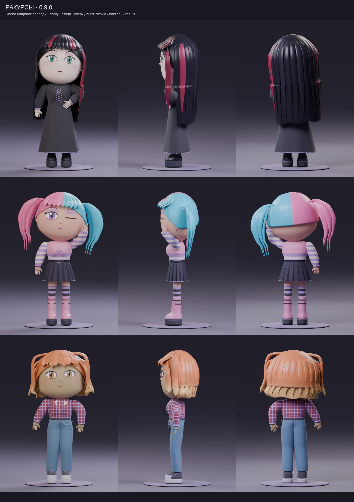

# Лица, волосы и кисти · 0.9.0

Это галерея версии 0.9.0. Обновлённые руки без стыка у запястья и посадка одежды показаны в [версии 0.9.1](BODY_FIT.md).

Первый этап визуальной доработки. Все изображения ниже — рендеры реальной геометрии дополнения в Blender 5.2.2 LTS; параметры трёх персонажей сохранены рядом с другими публичными примерами.

## Лица

- Готика: вытянутое лицо, спокойное выражение, чёрные волосы с бордовыми прядями.
- Пастельный образ: округлое лицо, подмигивание, розово-голубые хвостики.
- Гранж: более широкая челюсть, улыбка, веснушки, медный shag.

Во вкладке «Лицо» добавлена группа «Нос, губы и брови»: ширина и выступ носа, ширина рта, полнота губ, высота и изгиб бровей. Все шесть значений сохраняются в JSON и участвуют в независимой генерации лица. У подмигивания сохраняется толщина линии века; после переключения выражения открытый глаз восстанавливается.

Цвета контура и блика губ теперь отделены от материалов носа и нижнего века. Смена помады сохраняет цвет кожи носа.

## Волосы и ракурсы

Пряди постепенно сужаются к концам. Корни чёлки и верхних слоёв утоплены в причёску; верх чёлки следует округлой поверхности головы. Обновлены все 30 миниатюр волос и шесть миниатюр лиц.

## Кисти

Пальцы строятся как непрерывные сужающиеся поверхности и объединяются с ладонью. Это убирает повторяющиеся бугорки вдоль пальцев. Большой палец короче, ногти меньше и ближе к поверхности. Область запястья использует согласованное распределение влияния костей.

На крупном плане граница отдельных мешей кисти и предплечья ещё различима. Следующий этап включает доработку этого соединения вместе с телом и посадкой одежды. Ногти пока имеют один короткий профиль и общий цвет; отдельный редактор маникюра запланирован позже.

## Пресеты и повторение рендера

[Готика](../examples/character_study/goth.json) · [Пастель](../examples/character_study/pastel.json) · [Гранж](../examples/character_study/grunge.json)

Загрузи JSON через «Мои → Настройки: Открыть». Скрипты `render_character_study.py`, `render_hand_study.py` и `render_previews.py` создают эти виды в отдельных фоновых сценах. [Команды запуска](DEVELOPMENT.md).

Старые JSON получают нулевые значения новых настроек лица. Геометрия волос и кистей старых сцен обновляется при следующем применении параметров; прежние варианты остаются скрытым кешем. Ручную правку геометрии следует сохранять отдельным `.blend`.

[Проверки выпуска](VALIDATION.md) · [План следующих этапов](../ROADMAP.md) · [На главную](../README.md)
