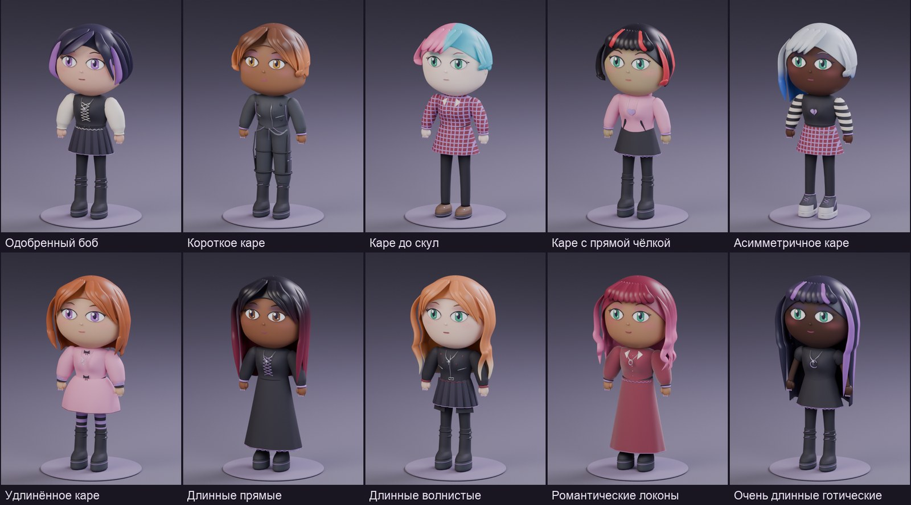
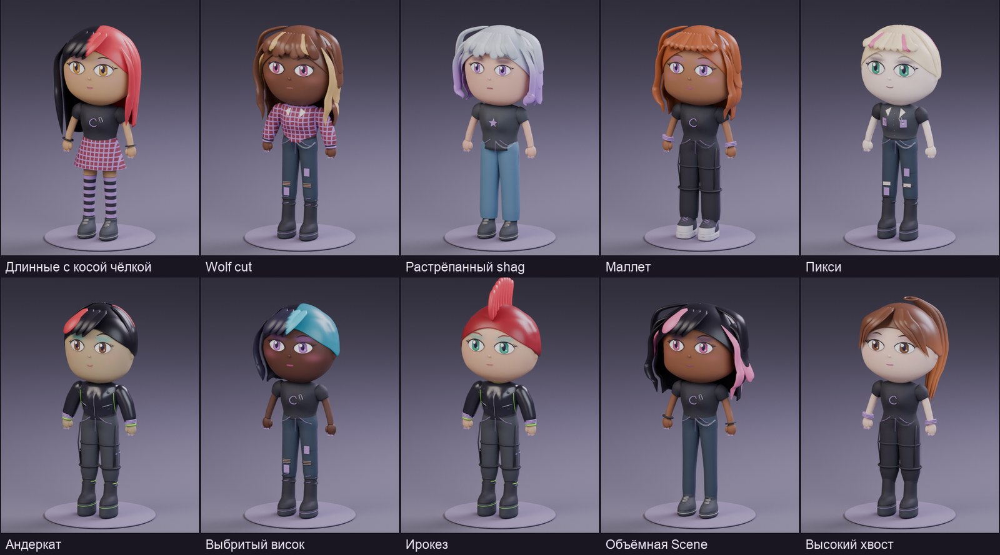
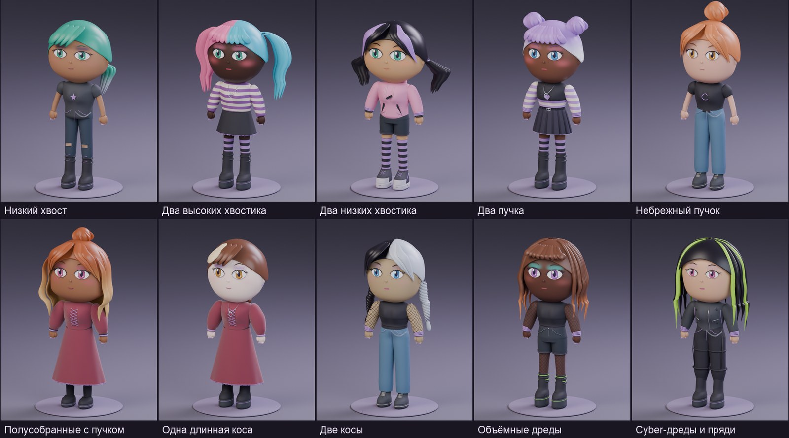
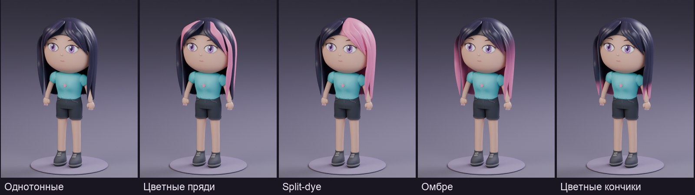
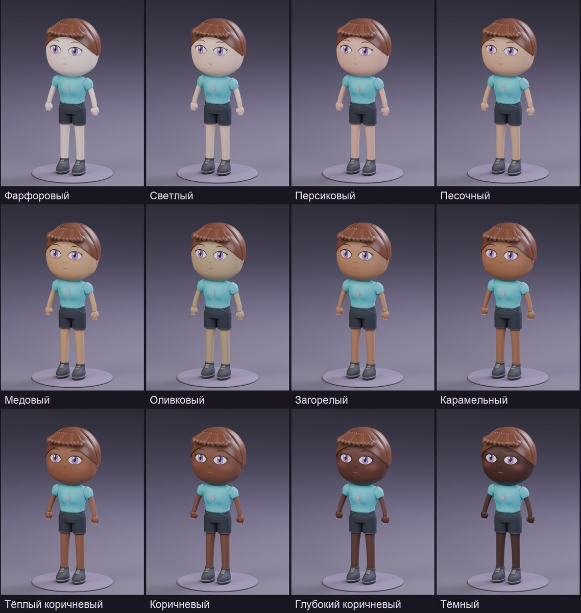
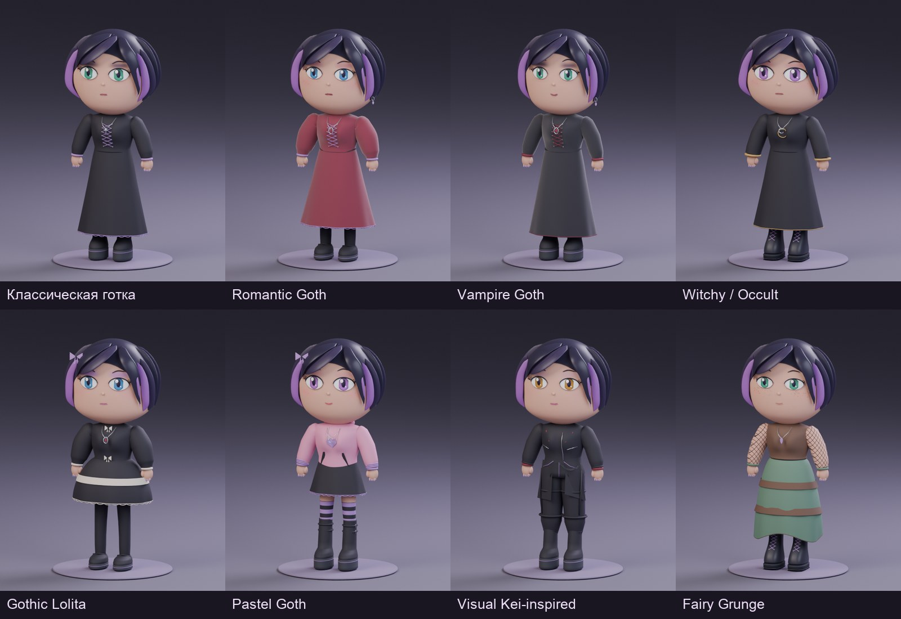
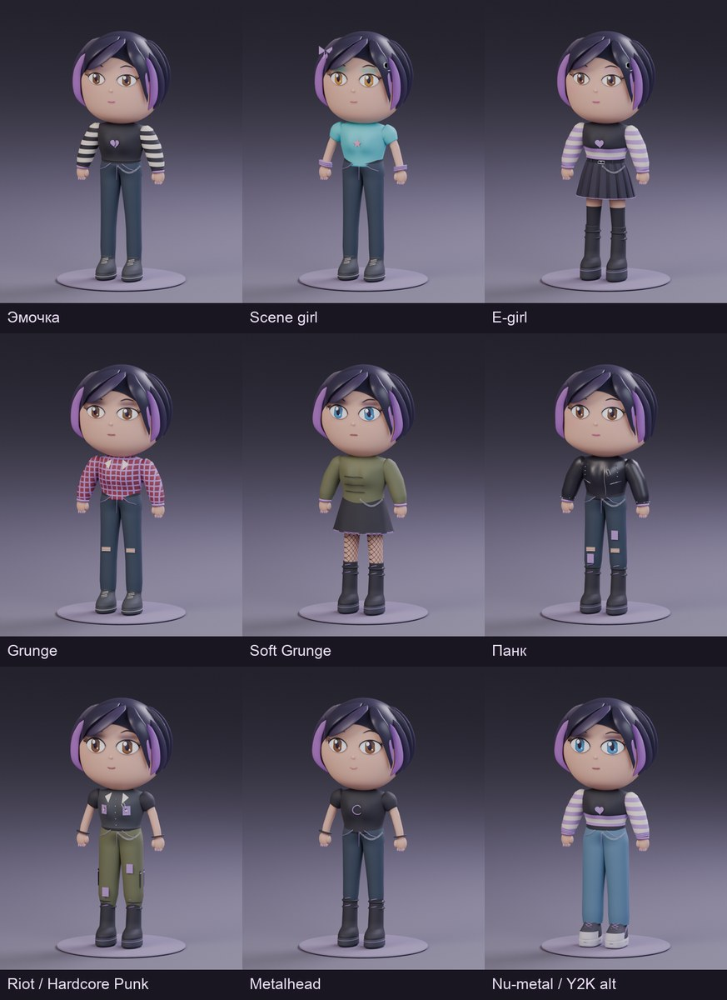
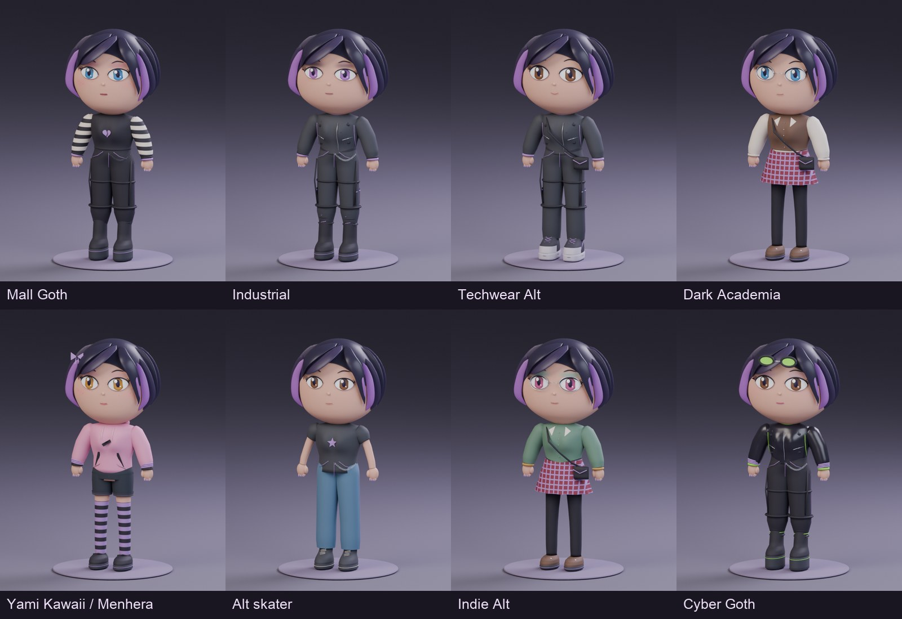

# Галерея

[На главную](../README.md)

Изображения получены рендером реальных сцен Blender. Каталоги показывают примеры сочетаний; случайная генерация даёт и другие варианты.

## Тело и посадка одежды · 0.9.1

[Сравнение, ракурсы и ограничения](BODY_FIT.md).

## Лица, волосы и кисти · 0.9.0

[Все ракурсы, крупные планы и настройки](CHARACTER_POLISH.md).

## Материалы · 0.8.1

[Сравнение до и после](MATERIALS.md).

## Кисти и позы · 0.8

## Волосы и кожа · 0.7

## Одежда и стили · 0.6

Кисти на рендерах 0.6–0.7 относятся к предыдущей версии. Актуальный результат показан в разделе 0.8.
