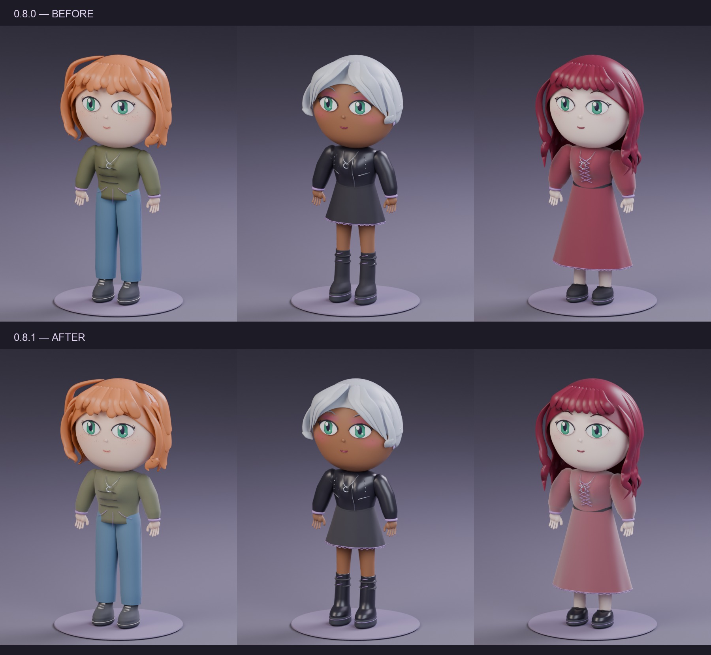

# Материалы и исправления · 0.8.1

Новые поверхности сохраняют пропорции, причёски, цвета и принты. Изменения намеренно небольшие: общий мультяшный вид остаётся прежним, а материалы лучше различаются под одним светом.

| Поверхность | Изменение |
| --- | --- |
| Ткань и вязка | Перекрёстный мелкий рельеф, мягкие блики; у вязки более крупный рисунок |
| Джинса | Диагональное переплетение и небольшая вариация шероховатости |
| Кожа одежды | Мелкое зерно и умеренный защитный блеск |
| Винил | Более гладкая поверхность и выраженный верхний блик |
| Бархат | Мягкий краевой отблеск и очень слабый рельеф |
| Резина | Более матовая поверхность подошв |
| Кожа персонажа | Мягче отражение и небольшое рассеяние света |

Координаты рельефа берутся из исходной сетки `Basis` и сохраняются в `ChibiRestPosition`. Изменение роста, формы тела и позы не меняет этот атрибут. Внешних текстурных файлов нет. Для игрового экспорта всё ещё требуется запекание/преобразование материалов.

## Сравнение

Одинаковые параметры персонажей, камера, освещение и seed рендера. Верхний ряд — предыдущие материалы 0.8.0; нижний — 0.8.1. На общем плане изменения ткани деликатные, обувь и блики кожи одежды различаются сильнее.

Скрипт [render_material_study.py](../scripts/render_material_study.py) воспроизводит три новых изображения. Команда приведена в [инструкции разработчика](DEVELOPMENT.md#рендеры-материалов).

## Исправленные ошибки

- Кеш исходных мешей обновляется после замены данных Blender; создание нового персонажа после «Файл → Новый» работает.
- Видимость косметики отделена от гардероба. Веснушки можно отключать и включать; смена одежды не показывает вручную скрытый посторонний меш.
- Повторная генерация по номеру сохраняет выбранную позу и независимые жесты.
- Загрузка JSON подготавливает камеру и студию, в том числе при создании персонажа в пустой сцене.
- Известные материалы в старых сохранениях обновляются без создания новой геометрии; их цвета сохраняются.

Эти сценарии проверены отдельными наборами `regressions` и `surfaces`. [Отчёт выпуска](VALIDATION.md).

[На главную](../README.md)
